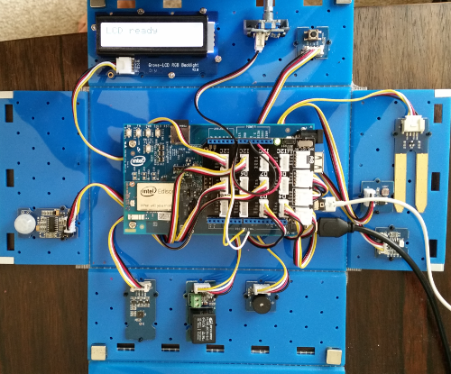

<h1>Intel Edison Projects</h1>

The following is a collection of Internet of Things (IoT) projects that run on an
    <a href="https://www.sparkfun.com/products/13097">Intel Edison, attached to an Arduino Breakout Kit</a>.
    The <a href="http://www.intel.com/content/www/us/en/do-it-yourself/edison.html">Intel Edison</a> is
    a small (<a href="https://www.sparkfun.com/products/13024">$49</a>) single board computer, powered
    by the Intel® Atom™ SoC dual-core CPU and including an integrated WiFi, and Bluetooth LE.  The Arduino
    Breakout Kit, extends the Intel Edison interface, and allows the user to connect to the board using
    the popular Arduino hardware interface.  There are many hardware shields which allow easy connection
    of sensors and devices to the Arduino interface.

Most of the examples in this library, are interacting with sensors/devices from the
    <a href="http://www.seeedstudio.com/depot/Grove-Indoor-Environment-Kit-for-Intel-Edison-p-2427.html">
    Grove Indoor Environment Kit</a>, which connects to the Arduino Breakout Kit via the Grove
    base shield.

<h2>Projects</h2>
<h3>Blinking an LED using different interfaces</h3>

This group of projects blink an LED connected to GPIO 13.  This LED is built into all Arduino
    boards, and blinking it is a quick way to make sure the electronics is alive and working.  It is
    the equivalent of the software "Hello World" first program to make sure things are working.  There
    are several different environments/interfaces that I'm using to drive the electronics, and these
    projects demonstrate the use of these different interfaces.

    
<ol>
<li>blink-mraa</li>

The MRAA library is low level skeleton library for IO communications with a variety of GNU/Linux platforms,
    including the Intel Edison.  This project blinks the LED connected to GPIO 13, using this library.

<li>blink-j5</li>

Johnny Five is a javascript IoT Robotics Programming Framework.  This project blinks the LED connected to
    GPIO 13, using this library.

<li>blink-cylon</li>

Cylon is a javascript Robotics framework.  This project blinks the LED connected to GPIO 13, using
    this library.

<li>simple-api</li>

This project (simple-api) is a node js, express js, and Cylon app, which creates
    a simple http api, to control an LED, depending upon what http calls are
    made.  http get calls to 192.168.1.83:2000/api/lighton turn the led on, and get calls
    to http://192.168.1.83:2000/api/lightoff turn the led off.

<li>IntelIotBlink</li>

This project is built upon the MRAA library, and is setup to run using the Intel IoT XDK.  The Intel
    XDK manages downloading the npm packages, monitoring file changes, and downloading the new information
    to the Intel device.  Once the program is downloaded to the target device, it will install the npm
    packages on the target device, and run the program in a debug mode, which allows remote breakpoints,
    or displaying variables.  This project blinks the LED connected to GPIO 13, using this library.

<li>IntelCylonBlink</li>

This project is built upon the Cylon library, and is setup to run using the Intel IoT XDK.  This project
    blinks the LED connected to GPIO 13, using this library.

</ol>